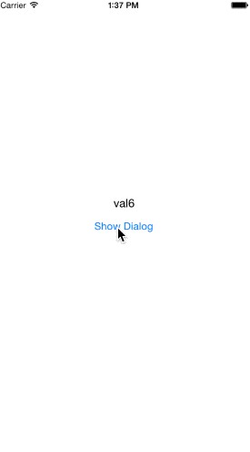

# CustomPickerDialog-Swift

[](https://developer.apple.com/iphone/index.action)
[](https://developer.apple.com/swift)
[](http://mit-license.org)



# Installation
### CocoaPods
In your `Podfile`:
```
pod "CustomPickerDialog-Swift"
```
And in your `*.swift`:
```swift
import CustomPickerDialog_Swift
```

# Usage

```swift
let pickerView = CustomPickerDialog(dataSource: [1,2,3,4,5,6]) { (data) -> String in
    return "val\(String(data))"
}

pickerView.selectRow(3)
        
pickerView.showDialog("CustomPickerDialog", doneButtonTitle: "done", cancelButtonTitle: "cancel") { (result) -> Void in
                    
    self.lblResult.text = "val\(String(result))"
                                
}
```
